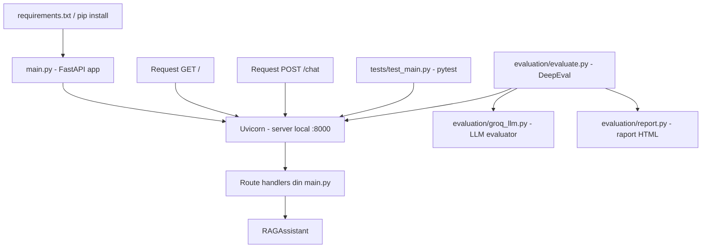

# Structura Tema 3 (main, tests, evaluation)

Acest document explica ce contine folderul `Tema3` si cum se leaga fisierele intre ele.

## Referinta si mentenanta

- Fisierul de referinta pentru arhitectura temei este chiar `STRUCTURA_TEMA3.md`.
- Cand adaugi componente noi (endpoint-uri, teste, metrici, fisiere de configurare), actualizeaza acest document si diagrama de mai jos.

## Structura folderului

```text
Tema3/
├── main.py
├── README.md
├── tests/
│   └── test_main.py
└── evaluation/
    ├── evaluate.py
    ├── groq_llm.py
    └── report.py
```
## Diagrama actualizata (componente + cerinte)



## Diagrama simpla (text)

```text
main.py (FastAPI)
   |\
   | \__ tests/test_main.py (verifica functionalitatea API)
   |
   \____ evaluation/evaluate.py (masoara calitatea raspunsurilor)
              |
              +--> evaluation/groq_llm.py (LLM evaluator)
              |
              +--> evaluation/report.py (raport HTML)
```

## Rolul fiecarui fisier

### `main.py`
- Porneste aplicatia FastAPI.
- Expune endpoint-uri:
  - `GET /` pentru health check.
  - `POST /chat/` pentru raspunsuri de la asistent.
- Creeaza instanta `RAGAssistant` si o foloseste in endpoint-ul de chat.

### `tests/test_main.py`
- Contine testele automate pentru API-ul din `main.py`.
- Scopul este sa verifice endpoint-urile (`/` si `/chat/`) in scenarii pozitive/negative.
- Fisierul este in stadiu ToDo (de completat).

### `evaluation/evaluate.py`
- Ruleaza o evaluare de calitate pe raspunsurile endpoint-ului `/chat/`.
- Defineste cazuri de test (`LLMTestCase`) si calculeaza scoruri cu metrici `GEval`.
- Apeleaza API-ul prin HTTP (`http://127.0.0.1:8000/chat/`).
- Salveaza rezultatele prin `save_report(...)`.

### `evaluation/groq_llm.py`
- Adaptor pentru modelul Groq folosit in evaluare (`DeepEvalBaseLLM`).
- Este modelul evaluator (LLM-as-a-judge), nu endpoint-ul principal FastAPI.

### `evaluation/report.py`
- Genereaza raport HTML pe baza scorurilor de evaluare.
- Scrie fisierele in `evaluation/output/`.

## Implementare

### Instalare dependinte (inclusiv Uvicorn)

```powershell
# adaugam in store-ul existent noile dependinte (FastAPI, Uvicorn, pytest, DeepEval)
pip install -r .\Lectia5\Tema3\requirements.txt
```

### Server API
```powershell
python -m uvicorn --app-dir .\Lectia5\Tema3 main:app --reload --port 8000
```

### Testare din FastAPI Docs (/docs)

1. Deschide in browser: `http://127.0.0.1:8000/docs`.
2. Verifica faptul ca apar endpoint-urile:
   - `GET /` (Root)
   - `POST /chat/` (Chat)
3. Pentru `POST /chat/`, apasa `Try it out` si trimite un payload JSON de forma:

```json
{
  "message": "Ce trasee usoare recomanzi in Busteni?"
}
```

4. Raspunsul asteptat este un JSON cu cheia `response`.

Captura ta din `/docs` confirma corect expunerea endpoint-urilor `GET /` si `POST /chat/`.

### Teste
```powershell
pytest
```

### Evaluare
```powershell
python -m evaluation.evaluate
```

## Nota
- Pentru teste si evaluare, serverul din `main.py` trebuie sa fie pornit in paralel.
