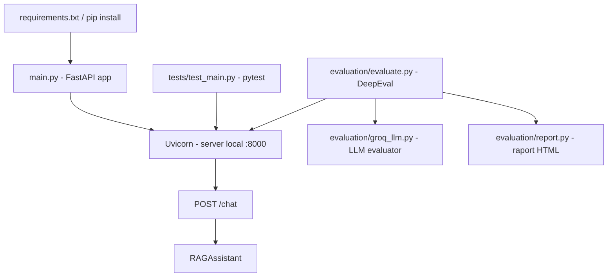

# Structura Tema 3 (main, tests, evaluation)

Acest document explica ce contine folderul `Tema3` si cum se leaga fisierele intre ele.

## Referinta si mentenanta

- Fisierul de referinta pentru arhitectura temei este chiar `STRUCTURA_TEMA3.md`.
- Cand adaugi componente noi (endpoint-uri, teste, metrici, fisiere de configurare), actualizeaza acest document si diagrama de mai jos.

## Structura folderului

```text
Tema3/
├── main.py
├── README.md
├── tests/
│   └── test_main.py
└── evaluation/
    ├── evaluate.py
    ├── groq_llm.py
    └── report.py
```

## Rolul fiecarui fisier

### `main.py`
- Porneste aplicatia FastAPI.
- Expune endpoint-uri:
  - `GET /` pentru health check.
  - `POST /chat/` pentru raspunsuri de la asistent.
- Creeaza instanta `RAGAssistant` si o foloseste in endpoint-ul de chat.

### `tests/test_main.py`
- Contine testele automate pentru API-ul din `main.py`.
- Scopul este sa verifice endpoint-urile (`/` si `/chat/`) in scenarii pozitive/negative.
- Fisierul este in stadiu ToDo (de completat).

### `evaluation/evaluate.py`
- Ruleaza o evaluare de calitate pe raspunsurile endpoint-ului `/chat/`.
- Defineste cazuri de test (`LLMTestCase`) si calculeaza scoruri cu metrici `GEval`.
- Apeleaza API-ul prin HTTP (`http://127.0.0.1:8000/chat/`).
- Salveaza rezultatele prin `save_report(...)`.

### `evaluation/groq_llm.py`
- Adaptor pentru modelul Groq folosit in evaluare (`DeepEvalBaseLLM`).
- Este modelul evaluator (LLM-as-a-judge), nu endpoint-ul principal FastAPI.

### `evaluation/report.py`
- Genereaza raport HTML pe baza scorurilor de evaluare.
- Scrie fisierele in `evaluation/output/`.

## Relatia dintre fisiere

## 1) Flux aplicatie (runtime)
1. Pornesti serverul din `main.py` cu `uvicorn`.
2. Endpoint-ul `POST /chat/` apeleaza `RAGAssistant.assistant_response(...)`.
3. Clientii (sau scripturile de test/evaluare) primesc raspuns JSON.

## 2) Flux teste unitare
1. `tests/test_main.py` trimite request-uri catre API-ul pornit din `main.py`.
2. Verifica status code + continut raspuns.
3. Semnaleaza regresii in comportamentul endpoint-urilor.

## 3) Flux evaluare calitativa
1. `evaluation/evaluate.py` trimite input-uri de evaluare catre `POST /chat/`.
2. Raspunsurile sunt scorate de metrici `GEval` folosind modelul din `groq_llm.py`.
3. `report.py` genereaza raport HTML cu scoruri si explicatii.

## Diagrama actualizata (componente + cerinte)



## Diagrama simpla (text)

```text
main.py (FastAPI)
   |\
   | \__ tests/test_main.py (verifica functionalitatea API)
   |
   \____ evaluation/evaluate.py (masoara calitatea raspunsurilor)
              |
              +--> evaluation/groq_llm.py (LLM evaluator)
              |
              +--> evaluation/report.py (raport HTML)
```

## Cum rulezi, pe scurt

### Instalare dependinte (inclusiv Uvicorn)

```powershell
pip install -r requirements.txt
pip install fastapi uvicorn pytest deepeval
```

### Server API
```powershell
uvicorn main:app --reload --port 8000
```

### Teste
```powershell
pytest
```

### Evaluare
```powershell
python -m evaluation.evaluate
```

## Nota
- Pentru teste si evaluare, serverul din `main.py` trebuie sa fie pornit in paralel.
